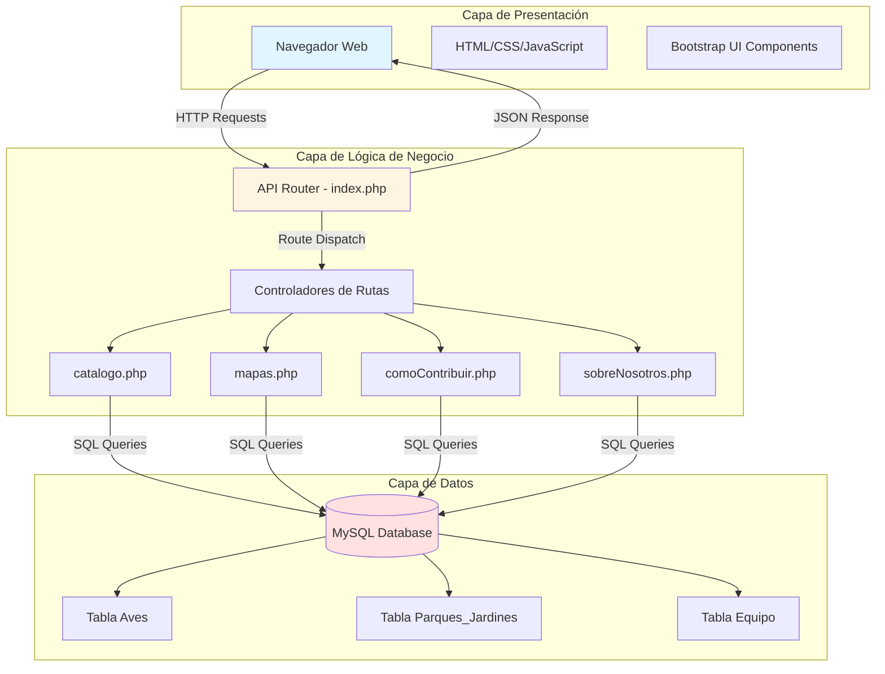
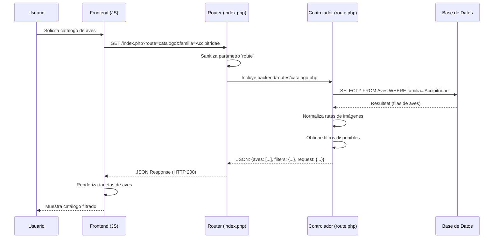

<div align="center">

<!-- ABRIR CON UN VISUALIZADOR MARKDOWN O VISITAR GITHUB PARA VER GIFS Y DIAGRAMAS MERMAID CORRECTAMENTE -->

# **Ornitología Mallorca**  
## *Proyecto Final – Práctica 1*  
## *Asignatura: Aplicaciones Distribuidas en Internet e Interfaces de Usuario (ADIU)*

### **Integrantes del Grupo**  
**Dylan Luigi Canning García**  
**Blanca Atiénzar Martínez**

**Página web del proyecto:**  
https://ornitologia.rf.gd/

**Github del proyecto**
https://github.com/dylanluigi/Ornitologia-Website

</div>

---
---

## Índice

1. [Descripción del Proyecto](#descripción-del-proyecto)
2. [Contexto y Objetivos](#contexto-y-objetivos)
3. [Tecnologías Utilizadas](#tecnologías-utilizadas)
4. [Arquitectura del Sistema](#arquitectura-del-sistema)
5. [Estructura del Código](#estructura-del-código)
6. [Diseño de Base de Datos](#diseño-de-base-de-datos)
7. [Instrucciones de Instalación y Ejecución](#instrucciones-de-instalación-y-ejecución)
8. [Endpoints de la API](#endpoints-de-la-api)
9. [Guía de Desarrollo](#guía-de-desarrollo)
10. [Resolución de Problemas](#resolución-de-problemas)
11. [Referencias Bibliográficas](#referencias-bibliográficas)

---


## Descripción del Proyecto

La web creada Ornitología Mallorca es una pagina que definiriamos como web de caracter educativo y cientifico para catalogar, visualizar y gestionar informacion ornitológica relacionada con las especies de aves presentes en la isla de Mallorca, con especial énfasis en las especies endémicas, amenazadas y de interés conservacionista. 

Nos centramos en crear dicha pagina por el mal estado o inexistencia de este tipo de paginas en mallorca. Para ello hemos desarrollado la apliación como un sistema que implementa una arquitectura cliente-servidor tradicional, donde el frontend proporciona una interfaz de usuario intuitiva y responsive, mientras que el backend gestiona el acceso a datos mediante una API RESTFUL que consulta una base de datos relacional MySQL/MariaDB.

### Características Principales

- **Catálogo Interactivo de Especies**: Base de datos con 47 especies de aves, incluyendo información taxonómica, morfológica, ecológica y de conservación.
- **Sistema de Filtrado Avanzado**: Permite búsquedas por nombre común, nombre científico, familia, categoría de conservación, patrón migratorio, y otros criterios taxonómicos.
- **Visualización Geoespacial**: Mapas interactivos que muestran la distribución de especies en parques naturales y áreas protegidas de Mallorca.
- **Información de Parques y Reservas**: Catálogo georreferenciado de 13 espacios naturales protegidos con datos de ubicación, características y fauna asociada.
- **Sistema de Análisis de Densidad**: Visualizaciones de densidad estacional de aves mediante gráficos interactivos generados con Highcharts.
- **Gestión de Planes de Recuperación**: Información detallada sobre planes de conservación para especies amenazadas (Pardela balear, Águila perdicera, Malvasía cabeciblanca).
- **Diseño Responsive**: Interfaz adaptable a dispositivos móviles, tablets y ordenadores de escritorio mediante Bootstrap.

Mobile Version             |  Desktop Version
:-------------------------:|:-------------------------:
{ .image25percent }  |  { .image25percent }


---

## Tecnologías Utilizadas

### Frontend

| Tecnología | Versión/Tipo | Propósito |
|------------|--------------|-----------|
| **HTML5** | Estándar | Estructura semántica de contenido |
| **CSS3** | Estándar | Estilos y diseño visual |
| **JavaScript (ES6+)** | Vanilla JS | Lógica de cliente y manipulación del DOM |
| **Bootstrap** | 5.x (CDN) | Framework CSS responsive y componentes UI |
| **Highcharts** | 11.x (CDN) | Generación de gráficos interactivos |
| **Fetch API** | Nativa | Comunicación asíncrona con el backend |

### Backend

| Tecnología | Versión | Propósito |
|------------|---------|-----------|
| **PHP** | 7.4+ / 8.x | Lenguaje de servidor |
| **MySQLi** | Extensión nativa | Interfaz de acceso a base de datos |
| **MySQL / MariaDB** | 5.7+ / 10.x+ | Sistema de gestión de base de datos relacional |

### Infraestructura de Desarrollo

- **Servidor Web**: PHP Built-in Server (desarrollo) / Apache/Nginx (producción)
- **Servidor Frontend**: Python HTTP Server / Node.js serve (desarrollo)
- **Control de Versiones**: Git

---

## Arquitectura del Sistema

### Visión General

El sistema implementa una **arquitectura de tres capas** (three-tier architecture):



### Flujo de Datos



### Arquitectura de Backend: Sistema de Enrutamiento

El backend implementa un **patrón Front Controller** donde todas las peticiones pasan por un único punto de entrada (`backend/public/index.php`) que actúa como enrutador:

1. **Recepción de Petición**: El cliente envía una petición con el parámetro `?route=nombreRuta`.
2. **Sanitización**: El enrutador elimina caracteres peligrosos (`..`, `\\`, `//`) para prevenir ataques de directory traversal.
3. **Resolución de Ruta**: Se construye la ruta del archivo: `backend/routes/{nombreRuta}.php`.
4. **Validación**: Se verifica la existencia del archivo.
5. **Ejecución**: Se incluye y ejecuta el controlador de ruta correspondiente.
6. **Respuesta**: El controlador genera una respuesta JSON que se envía al cliente.

---

## Estructura del Código

### Estructura de Directorios

```
Practica-ADIU-master/
│
├── backend/                        # Código del servidor
│   ├── config/
│   │   └── conexion.php           # Configuración de conexión a BD
│   │
│   ├── public/
│   │   └── index.php              # Punto de entrada de la API (Front Controller)
│   │
│   ├── routes/                     # Controladores de endpoints
│   │   ├── catalogo.php           # Endpoint de catálogo de aves
│   │   ├── comoContribuir.php     # Endpoint de lugares de contribución
│   │   ├── mapas.php              # Endpoint de datos geográficos
│   │   ├── sobreNosotros.php      # Endpoint de equipo
│   │   ├── avesConUbicacion.php   # Endpoint de aves georreferenciadas
│   │   └── densidadEstacional.php # Endpoint de análisis temporal
│   │
│   └── sql/
│       └── DB.sql                 # Script de creación e inicialización de BD
│
├── frontend/                       # Código del cliente
│   ├── pages/                      # Páginas HTML
│   │   ├── catalogo.html          # Página de catálogo interactivo
│   │   ├── como-contribuir.html   # Página de contribución
│   │   ├── mapas.html             # Página de mapas interactivos
│   │   └── sobre-nosotros.html    # Página de equipo
│   │
│   ├── partials/                   # Componentes reutilizables
│   │   ├── header.html            # Cabecera común
│   │   └── footer.html            # Pie de página común
│   │
│   ├── css/
│   │   └── global.css             # Estilos centralizados
│   │
│   ├── js/                         # Scripts de cliente
│   │   ├── api.js                 # Cliente API (wrapper de fetch)
│   │   ├── catalogo.js            # Lógica de catálogo y filtros
│   │   ├── comoContribuir.js      # Lógica de carousels de planes
│   │   ├── maps.js                # Generación de gráficos Highcharts
│   │   ├── sobreNosotros.js       # Renderizado de equipo
│   │   ├── index.js               # Lógica de página principal
│   │   └── includes.js            # Utilidades de inclusión
│   │
│   ├── img/                        # Recursos gráficos
│   │   ├── Aves/                  # Fotografías de especies (47 especies)
│   │   ├── Lugares/               # Imágenes de parques y reservas
│   │   ├── Planes/                # Imágenes de planes de recuperación
│   │   └── People/                # Fotografías del equipo
│   │
│   ├── video/
│   │   └── sky.mp4                # Video de fondo (página principal)
│   │
│   └── index.html                 # Página de inicio
└──
```

### Componentes Principales del Frontend

#### 1. Cliente API (`frontend/js/api.js`)

```javascript
// Wrapper centralizado para comunicación con el backend
const api = {
  // Realiza peticiones GET
  async get(url) { /* ... */ },

  // Realiza peticiones POST
  async post(url, body = {}) { /* ... */ },

  // Construye URLs con parámetros
  routeUrl(route, params = {}) { /* ... */ },

  // Método de conveniencia para rutas
  async route(route, params = {}) { /* ... */ }
};
```

**Funcionalidad**: Abstrae la lógica de comunicación HTTP, gestión de errores y construcción de URLs parametrizadas.

#### 2. Sistema de Filtrado (`frontend/js/catalogo.js`)

- Renderiza dinámicamente controles de filtro basados en datos del backend
- Implementa búsqueda por nombre (común/científico) con autocompletado por letra
- Aplica filtros múltiples: familia, categoría de conservación, patrón migratorio, endemismo
- Genera tarjetas (cards) de aves con información resumida
- Gestiona modales con información detallada de cada especie

#### 3. Visualización de Mapas (`frontend/js/maps.js`)

- Integra Highcharts para generación de gráficos de densidad
- Procesa datos de ubicación para visualización geoespacial
- Renderiza gráficos de densidad estacional
- Maneja interactividad (zoom, tooltips, leyendas)

### Componentes Principales del Backend

#### 1. Router Principal (`backend/public/index.php`)

```php
<?php
// Configuración de headers CORS
header('Content-Type: application/json; charset=utf-8');
header("Access-Control-Allow-Origin: *");

// Obtención y sanitización de la ruta
$route = $_GET['route'] ?? '';
$route = trim(str_replace(['..', '\\', '//'], '', $route));

// Construcción del path del controlador
$file = __DIR__ . '/../routes/' . $route . '.php';

// Validación y ejecución
if ($route === '') {
    http_response_code(400);
    echo json_encode(["error" => "No route specified"]);
    exit;
}

if (!is_file($file)) {
    http_response_code(404);
    echo json_encode(["error" => "Route not found"]);
    exit;
}

require $file;
```

#### 2. Controlador de Catálogo (`backend/routes/catalogo.php`)

**Funciones principales**:

- `normalize_ave_img($raw)`: Normaliza rutas de imágenes a formato consistente
- `distinct_values($conn, $field)`: Obtiene valores únicos de una columna para filtros
- `int_param($key)`: Extrae y sanitiza parámetros numéricos

---

## Instrucciones de Instalación y Ejecución

### Requisitos del Sistema

#### Requisitos Mínimos

- **PHP**: 7.4 o superior (recomendado 8.0+)
- **MySQL/MariaDB**: 5.7+ / 10.3+
- **Navegador Web**: Chrome 90+, Firefox 88+, Safari 14+, Edge 90+
- **Espacio en Disco**: 500 MB (incluyendo imágenes)
- **RAM**: 512 MB disponibles

#### Herramientas Adicionales

- **Python**: 3.7+ (para servidor de desarrollo frontend)
- **Git**: Para control de versiones (opcional)
- **Cliente MySQL**: mysql-client o phpMyAdmin

### Instalación Paso a Paso

#### 1. Clonar o Descargar el Repositorio

```bash
git clone <repository-url> Practica-ADIU-master
cd Practica-ADIU-master
```

#### 2. Configuración de la Base de Datos

##### a) Crear la Base de Datos

```bash
# Linux o macOS
mysql -u root -p < backend/sql/DB.sql

# Windows PowerShell
Get-Content backend/sql/DB.sql | mysql -u root -p

# Specify DB
mysql -u root -p aves_mallorca < backend/sql/DB.sql
```

##### b) Verificar la Importación

```bash
mysql -u root -p

USE aves_mallorca;
SHOW TABLES;
-- Deberia haber: Aves, Parques_Jardines, Equipo

SELECT COUNT(*) FROM Aves;
-- Deberia haber: 47

SELECT COUNT(*) FROM Parques_Jardines;
-- Deberia haber: 13

SELECT COUNT(*) FROM Equipo;
-- Deberia haber: 4
```


#### 3. Configuración del Backend

##### Editar Archivo de Conexión

Abrir `backend/config/conexion.php` y configurar las credenciales:

```php
<?php
$DB_HOST = getenv('DB_HOST') ?: '127.0.0.1';
$DB_USER = getenv('DB_USER') ?: 'root';           // Cambiar por propio
$DB_PASS = getenv('DB_PASS') ?: 'adminadmin';     // Cambiar por propio
$DB_NAME = getenv('DB_NAME') ?: 'aves_mallorca';
```

#### 4. Iniciar el Servidor Backend

```bash
# Navegar al directorio público del backend
cd backend/public

# Iniciar servidor PHP
php -S localhost:8081
```

#### 5. Configurar el Frontend

##### Actualizar URL de la API

Abrir `frontend/js/api.js` y verificar/actualizar la URL base:

```javascript
const API_BASE = 'http://localhost:8081/index.php';
```

Si se cambió el puerto del backend, actualizar dicha API @

#### 6. Iniciar el Servidor Frontend

##### Opción 1: Python HTTP Server

```bash
# En una nueva terminal
cd frontend


python3 -m http.server 8080
```

##### Opción 2: Node.js serve

```bash
cd frontend
serve -p 8080
```

##### Opción 3: PHP Server

```bash
cd frontend
php -S localhost:8080
```

#### 7. Acceder a la Aplicación

Abrir el navegador y visitar:

```
http://localhost:8080/index.html
```

## Endpoints de la API

### Formato General

**Base URL**: `http://localhost:8081/index.php`

**Patrón**: `GET /index.php?route={nombreRuta}&param1=valor1&param2=valor2`

**Content-Type**: `application/json; charset=utf-8`

**Headers CORS**: Configurados para permitir peticiones desde cualquier origen (desarrollo)

### Catálogo de Endpoints

#### 1. `catalogo` - Catálogo de Aves

**URL**: `/index.php?route=catalogo`

**Método**: `GET`

**Parámetros Opcionales**:

| Parámetro | Tipo | Valores Posibles | Descripción |
|-----------|------|------------------|-------------|
| `campoInicial` | string | `nombre_comun`, `nombre_cientifico` | Campo por el que ordenar inicialmente |
| `letter` | string | A-Z, Ñ | Primera letra para filtrar por nombre |
| `nombre` | string | Texto libre | Búsqueda parcial por nombre |
| `familia` | string | `Accipitridae`, `Anatidae`, etc. | Filtrar por familia taxonómica |
| `tipo_ave` | string | `Accipitriformes`, `Passeriformes`, etc. | Filtrar por orden |
| `endemica` | int | `0`, `1` | Filtrar especies endémicas |
| `categoria_conservacion` | string | Valores ENUM de tabla | Filtrar por estado de conservación |
| `patron_migratorio` | string | Texto libre | Filtrar por patrón migratorio |
| `id_parque` | int | 1-13 | Filtrar por parque asociado |

**Respuesta Exitosa** (200):

```json
{
  "aves": [
    {
      "id_ave": 1,
      "nombre_cientifico": "Puffinus mauretanicus",
      "nombre_comun": "Pardela balear",
      "familia": "Procellariidae",
      "tipo_ave": "Procellariiformes",
      "endemica": true,
      "descripcion": "Ave marina endémica...",
      "peso": "ligero",
      "tamano": "mediano",
      "vida_media": 30,
      "habitat_y_cria": "Mar abierto, acantilados...",
      "area_invernada": "Atlántico oriental...",
      "patron_migratorio": "Migradora postcría...",
      "categoria_conservacion": "Peligro de extinción",
      "plan_recuperacion": "Plan de recuperación del virot petit",
      "epoca_reproduccion": "Primavera",
      "curiosidades": "Principal causa de mortalidad...",
      "fotografias": "/img/Aves/puffinus_mauretanicus.jpg",
      "id_parque": 5
    }
  ],
  "filters": {
    "familias": ["Accipitridae", "Anatidae", ...],
    "tipos_ave": ["Accipitriformes", "Anseriformes", ...],
    "categorias_conservacion": ["Peligro de extinción", ...],
    "patrones_migratorios": ["Residente", "Migradora", ...],
    "parques": [
      {"id_parque": 1, "nombre": "Parc Natural de s'Albufera..."}
    ]
  },
  "request": {
    "campoInicial": "nombre_comun",
    "letter": "",
    "nombre": "",
    "familia": null,
    ...
  }
}
```

#### 2. `mapas` - Datos Geográficos y Estadísticas

**URL**: `/index.php?route=mapas`

**Método**: `GET`

**Parámetros**: Ninguno

**Respuesta**: Datos agregados para visualización de mapas y gráficos de densidad.

#### 3. `avesConUbicacion` - Aves Georreferenciadas

**URL**: `/index.php?route=avesConUbicacion`

**Método**: `GET`

**Parámetros**: Ninguno

**Respuesta**: Lista de aves con coordenadas geográficas de sus parques asociados.

#### 4. `densidadEstacional` - Análisis Temporal

**URL**: `/index.php?route=densidadEstacional`

**Método**: `GET`

**Parámetros**: Ninguno

**Respuesta**: Datos de densidad de especies por estación del año.

#### 5. `comoContribuir` - Lugares y Planes de Recuperación

**URL**: `/index.php?route=comoContribuir`

**Método**: `GET`

**Parámetros**: Ninguno

**Respuesta Exitosa** (200):

```json
{
  "carousel": [
    {
      "nombre": "Plan de recuperación del virot petit",
      "imagen": "/img/Planes/Puffinusmauretanicus.jpg",
      "descripcion": "Programa de conservación...",
      "especies": ["Puffinus mauretanicus"]
    }
  ],
  "lugares": [
    {
      "id_parque": 1,
      "nombre": "Parc Natural de s'Albufera de Mallorca",
      "ubicacion": "Norte de Mallorca...",
      "latitud": 39.7769120,
      "longitud": 3.1319590,
      "url": "https://...",
      "imagen": "../imgLugares/...",
      "especies_count": 12
    }
  ]
}
```

#### 6. `sobreNosotros` - Información del Equipo

**URL**: `/index.php?route=sobreNosotros`

**Método**: `GET`

**Parámetros**: Ninguno

**Respuesta Exitosa** (200):

```json
{
  "equipo": [
    {
      "id_miembro": 1,
      "nombre": "María González López",
      "rol": "Coordinadora de Proyecto",
      "descripcion": "Especialista en ornitología mediterránea...",
      "especializacion": "Aves marinas y rapaces",
      "fotografia": "../imgPeople/woman.jpg",
      "orden": 1
    }
  ]
}
```

### Códigos de Estado HTTP

| Código | Significado | Causa |
|--------|-------------|-------|
| 200 | OK | Petición procesada correctamente |
| 400 | Bad Request | Parámetro `route` no especificado |
| 404 | Not Found | Ruta no existe en `backend/routes/` |
| 500 | Internal Server Error | Error de conexión a base de datos o error de PHP |

---

## Referencias Bibliográficas

**DISCLAIMER**: Se ha usado herramientas de generación de texto para generar datos para la base de datos.

### Documentación Técnica

1. **PHP Documentation** - The PHP Group. (2024). _PHP Manual_. Disponible en: https://www.php.net/manual/
2. **MySQL Documentation** - Oracle Corporation. (2024). _MySQL 8.0 Reference Manual_. Disponible en: https://dev.mysql.com/doc/
3. **MDN Web Docs** - Mozilla Foundation. (2024). _JavaScript Reference_. Disponible en: https://developer.mozilla.org/
4. **Bootstrap Documentation** - Bootstrap Team. (2024). _Bootstrap 5 Documentation_. Disponible en: https://getbootstrap.com/docs/
5. **Highcharts Documentation** - Highsoft. (2024). _Highcharts API Reference_. Disponible en: https://api.highcharts.com/

### Recursos Ornitológicos

6. **GOB Mallorca** - Grup Balear d'Ornitologia i Defensa de la Naturalesa. _Anuaris ornitològics_. Disponible en: https://gobmallorca.com/
7. **IUCN Red List** - International Union for Conservation of Nature. (2024). _The IUCN Red List of Threatened Species_. Disponible en: https://www.iucnredlist.org/
8. **SEO/BirdLife** - Sociedad Española de Ornitología. _Atlas de las Aves Reproductoras de España_. Disponible en: https://www.seo.org/
9. **Conselleria de Medi Ambient** - Govern de les Illes Balears. _Catàleg de fauna i flora protegides_. Disponible en: https://www.caib.es/

### Estándares y Especificaciones

10. **RFC 7231** - Fielding, R., & Reschke, J. (2014). _Hypertext Transfer Protocol (HTTP/1.1): Semantics and Content_. IETF.
11. **RFC 8259** - Bray, T. (2017). _The JavaScript Object Notation (JSON) Data Interchange Format_. IETF.
12. **W3C HTML5** - World Wide Web Consortium. (2021). _HTML5: A vocabulary and associated APIs for HTML and XHTML_. W3C Recommendation.
